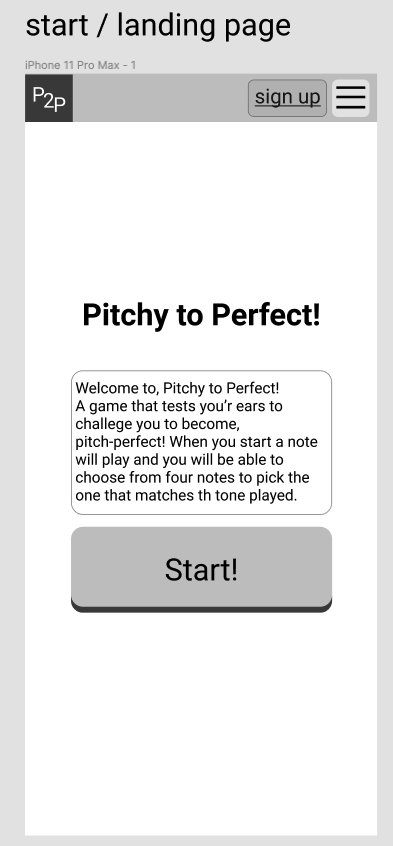

# Pitchy to Perfect
An app for developing a musical ear! 
Hear a note and guess which one it is from four possible options.
Train your ears and mind to be pitch perfect!

### A user can:
- sign up
- login
- start game

### A logged in user can:
- view their current highscore
- view the scoreboard
- acess and manipulate the options menu*

### MVP:
The above sans options menu.
That will be what I complete first after MVP has been met.

### Post MVP:
After further improving styling I would then move on to add functionality to game by,
adding a menu with various options to manipulate game play. 
I'd also like to eventually like to add game complexity by arpeggiating over chords or scales and have the user guess them.

---
### Technologies:
I will be using a Django backend with a PostgreSQL database and a react front end with the Semantic UI framework.

---

## wireframes:

---

## ERD:

